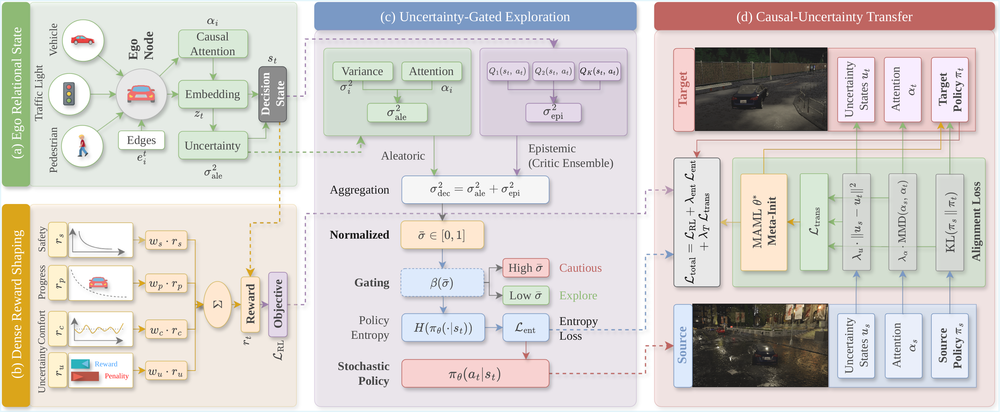
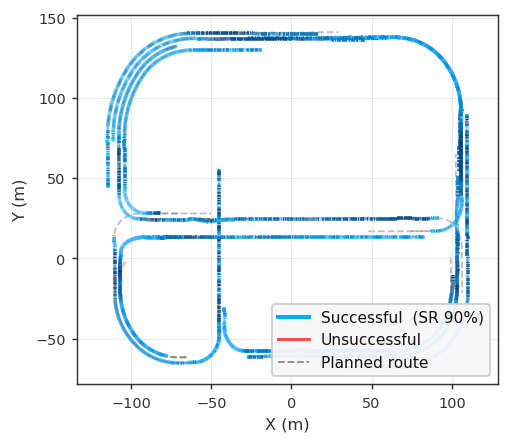
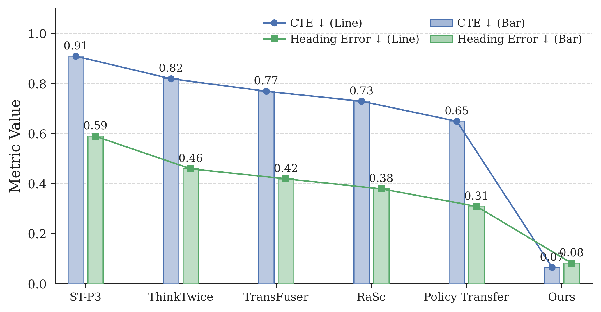
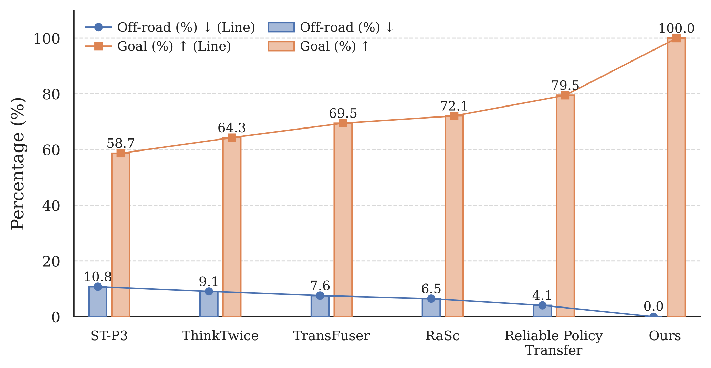
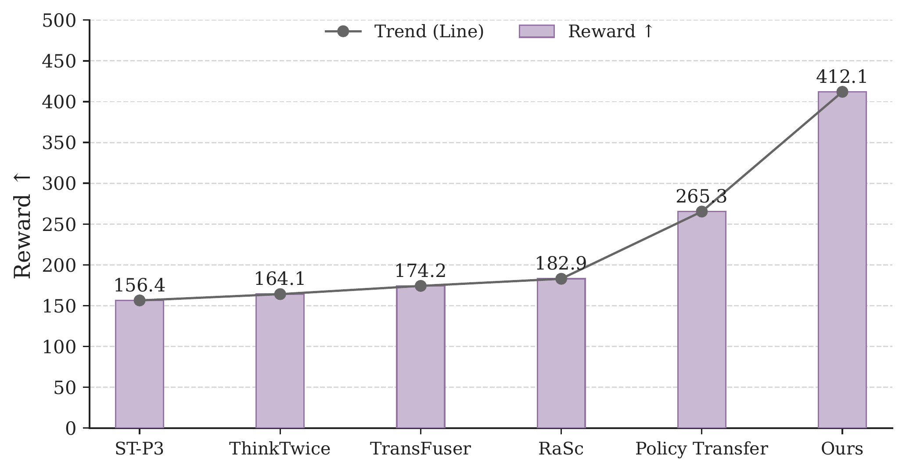
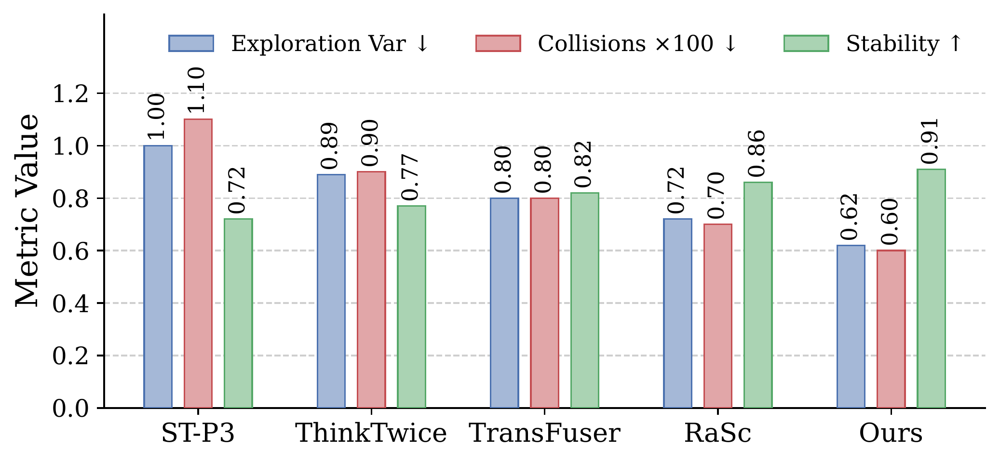
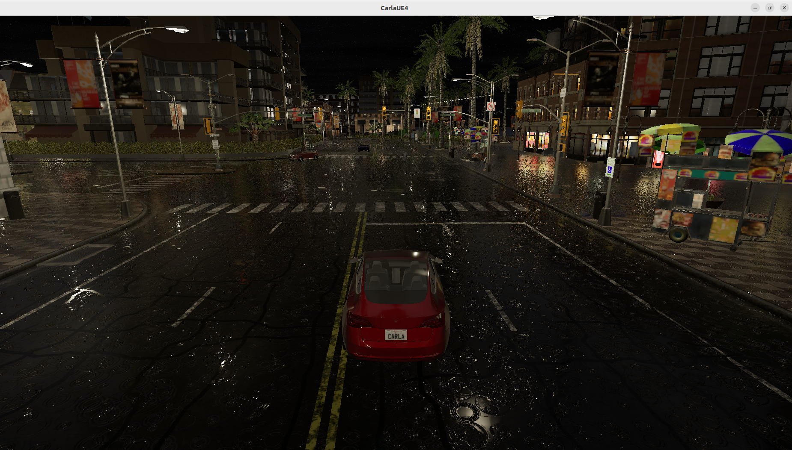
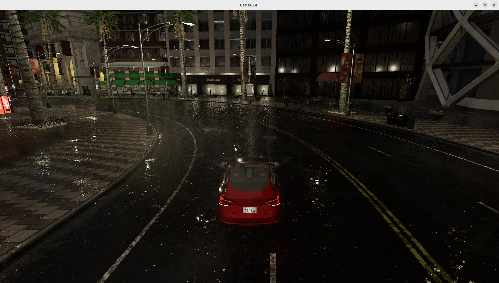
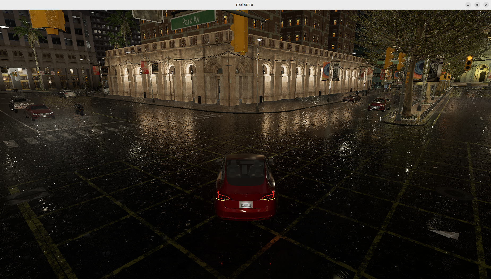

# Policy Transfer for Safety-Aware End-to-End Autonomous Driving

**Uncertainty-calibrated ego-relational policy transfer for closed-loop autonomous driving in CARLA**

[](https://www.python.org/)
[](https://carla.org/)
[](https://pytorch.org/)
[](#method-summary)
[](#transfer-learning)
[](#evaluation-protocol)

> **Paper:** *Policy Transfer for Safety-Aware End-to-End Autonomous Driving*  
> **Repository:** `drl-policy-transfer`  
> **Main implementation:** `car.py`  
> **Task:** End-to-end autonomous driving under weather, traffic, town, and route shift.

---

## Overview

<p align="justify">
This repository contains a CARLA-based implementation of <b>Policy Transfer for Safety-Aware End-to-End Autonomous Driving</b>. The work studies how an end-to-end deep reinforcement learning policy can make safer closed-loop driving decisions when the deployment town, weather, traffic density, and route configuration differ from the source training domain. The core idea is to use a shared uncertainty signal across four connected parts of the driving system: ego-relational state construction, dense reward shaping, uncertainty-gated exploration, and cross-domain policy transfer.
</p>

<p align="justify">
The implementation is centered on <code>car.py</code>, which includes the CARLA environment wrapper, ego-relational feature extraction, attention-based state encoder, stochastic actor, critic ensemble, uncertainty calibrator, replay buffer, source training loop, transfer/adaptation routines, and closed-loop evaluation. The repository also includes pretrained checkpoints, evaluation CSVs, logs, trajectories, plots, videos, and reproducibility scripts.
</p>

<p align="justify">
Unlike purely perception-heavy end-to-end driving models that compress the scene into a global tensor, this work represents nearby vehicles, pedestrians, traffic lights, lane geometry, route progress, and uncertainty as an ego-centered relational state. A control policy then learns throttle, brake, and steering while using calibrated uncertainty to reduce risky exploration and improve transfer consistency.
</p>

---

## Method Summary

<p align="center">
  
</p>

<p align="justify">
The framework connects four modules. First, the ego-relational state encoder builds a compact graph of nearby traffic entities and uses uncertainty-weighted influence attention to prioritize control-relevant actors. Second, the dense reward combines safety, route progress, comfort, and uncertainty terms so that the agent receives useful training feedback before terminal failures occur. Third, aleatoric edge variance and epistemic critic-ensemble variance are combined into a normalized uncertainty score that gates policy entropy. Fourth, transfer learning aligns action distributions, influence attention, and uncertainty statistics across source and target domains.
</p>

```text
CARLA scene observation
        |
        v
Ego-relational entity extraction
        |
        v
Uncertainty-weighted influence attention
        |
        v
Compact state encoder
        |
        v
SAC actor-critic policy
        |
        +--> Dense reward: safety + progress + comfort + uncertainty
        +--> Critic ensemble: epistemic uncertainty
        +--> Entropy gate: beta(sigma_bar) = beta0 * (1 - sigma_bar)
        +--> Transfer: policy KL + attention MMD + uncertainty matching
        |
        v
Closed-loop throttle, brake, steering
```

---

## Main Contributions Reflected in the Code

<p align="justify">
The repository implements the paper idea as a complete closed-loop simulation package. The main contributions are translated into executable components as follows:
</p>

| Paper component | Implementation in this repository | Purpose |
|---|---|---|
| Ego-relational state | `CarlaReliableTransferEnv._collect_entity_features()`, `GraphAttention`, `CompactStateEncoder` | Encodes nearby vehicles, pedestrians, traffic lights, route geometry, and uncertainty as an ego-centered control state. |
| Dense multi-objective reward | `_compute_reward_components()`, `build_reward_from_info()`, `recompute_agent_reward()` | Converts lane keeping, progress, proximity, red-light behavior, comfort, and uncertainty into smooth training feedback. |
| Aleatoric and epistemic uncertainty | Edge variance features, `n_critics=5`, `SACAgent.compute_sigma_bar()` | Combines observation uncertainty and critic disagreement into a normalized reliability signal. |
| Entropy-gated exploration | `UncertaintyCalibrator`, `SACAgent.compute_actor_loss()` | Reduces action randomness when decision uncertainty is high. |
| Influence-consistent transfer | `compute_transfer_loss()`, `maml_style_initialize()` | Aligns policy distributions, attention vectors, and uncertainty moments across domains. |
| Closed-loop assessment | `evaluate()`, result CSVs, trajectory exports, graph scripts/artifacts | Reports route completion, bounded driving score, infractions, TTC, CTE, intervention rate, and failure cases. |

---

## Repository Layout

```text
drl-policy-transfer/
├── car.py                                      <- complete CARLA environment, model, training, transfer, evaluation
├── requirements.txt                           <- Python dependencies used by car.py
├── README.md                                  <- project documentation
├── .gitignore
│
├── checkpoints/
│   ├── source_agent.pt                        <- source-domain trained checkpoint
│   └── source_agent_best.pt                   <- best saved source checkpoint
│
├── diagrams/
│   ├── unified_framework.pdf                  <- vector framework diagram
│   └── unified_framework.png                  <- GitHub-rendered framework diagram
│
├── figs/
│   ├── framework.pdf                          <- paper framework figure
│   ├── unified_framework.pdf                  <- framework vector figure
│   ├── reward.pdf                             <- reward design figure
│   ├── uncertainty.pdf                        <- uncertainty module figure
│   └── enrg.pdf                               <- auxiliary figure artifact
│
├── graphs/
│   ├── close_loop.png                         <- representative logged closed-loop trajectory figure
│   ├── state_stability.png / .pdf             <- CTE and heading stability analysis
│   ├── state_route.png / .pdf                 <- route-completion analysis
│   ├── reward_comparison.png / .pdf           <- dense reward comparison
│   ├── uncertainty_metrics.png / .pdf         <- uncertainty and safety metrics
│   ├── standardized_closed_loop.pdf           <- closed-loop DS/SR/IS comparison
│   ├── episode_statistics_heatmap.pdf         <- episode-level metric heatmap
│   ├── influence_attention_examples.pdf       <- attention examples for nearby actors
│   ├── uncertainty_training_curve.pdf         <- uncertainty and temperature training trace
│   ├── reliability_diagram_proxy.pdf          <- reliability-style safety-confidence proxy
│   ├── trajectories.pdf                       <- trajectory comparison
│   └── representative_trajectories_from_logs.pdf
│
├── results/
│   ├── Town02_zeroshot_source_agent.csv
│   ├── Town05_zeroshot_source_agent.csv
│   ├── Town10HD_Opt_zeroshot_source_agent.csv
│   ├── summaries/
│   │   ├── Town02_zeroshot_source_agent_summary.csv
│   │   ├── Town05_zeroshot_source_agent_summary.csv
│   │   └── Town10HD_Opt_zeroshot_source_agent_summary.csv
│   └── trajectories/
│       ├── Town10HD_Opt_zeroshot_source_agent_traj_ep01.csv
│       ├── ...
│       └── Town10HD_Opt_zeroshot_source_agent_traj_ep20.csv
│
├── logs/
│   ├── log.txt
│   ├── eval_500m_log.txt
│   ├── eval_500m_npc_log.txt
│   ├── eval_town02_150m_npc_log.txt
│   ├── eval_town02_200m_npc_log.txt
│   ├── eval_town05_npc_log.txt
│   ├── eval_town05_500m_npc_log.txt
│   └── eval_town10_mixed_log.txt
│
├── scripts/
│   ├── run_carla_server.sh                    <- start CARLA server on port 2200
│   ├── train_short.sh                         <- short source-domain training run
│   ├── train_paper.sh                         <- paper-scale source-domain training run
│   ├── eval_town05.sh                         <- Town05 zero-shot evaluation
│   ├── eval_town05_300m_npc.sh                <- Town05 300 m route with NPCs
│   ├── eval_town05_500m_npc.sh                <- Town05 500 m route with NPCs
│   ├── eval_town10hd.sh                       <- Town10HD evaluation
│   ├── eval_town10hd_500m_npc.sh              <- Town10HD 500 m route with NPCs
│   └── show_tree.sh
│
├── screenshot/
│   ├── 1.png
│   ├── 2.png
│   └── 3.png
│
├── video/
│   ├── 1.mp4 / 1.png
│   ├── 2.mp4 / 2.png
│   └── 3.mp4 / 3.png
│
└── docs/
    └── PROJECT_NOTES.md
```

---

## Code Tour

### `car.py`

<p align="justify">
The project is intentionally packaged around one main Python file so that the environment, model, training, adaptation, and evaluation logic stay synchronized. The most important sections are listed below.
</p>

| Section / object | Role |
|---|---|
| `_setup_carla_pythonapi()` | Adds the CARLA Python API to the runtime path. |
| `Config` | Stores simulator, route, reward, uncertainty, training, safety, and output settings. |
| `CarlaReliableTransferEnv` | Gym-compatible CARLA environment for route following, NPC handling, observation construction, reward computation, and termination logic. |
| `_collect_entity_features()` | Builds per-entity edge features for vehicles, pedestrians, and traffic lights. |
| `_route_observation_features()` | Computes route-progress, lane, heading, lookahead, and cross-track signals. |
| `_compute_reward_components()` | Produces smooth safety, progress, comfort, and uncertainty reward components. |
| `GraphAttention` | Applies uncertainty-weighted influence attention over the entity edges. |
| `CompactStateEncoder` | Fuses graph attention features with ego scalar route features. |
| `Actor` | Outputs continuous throttle, brake, and steering actions. |
| `Critic` | Q-value estimator; the implementation uses an ensemble for epistemic uncertainty. |
| `ReplayBuffer` | Stores off-policy SAC transitions. |
| `UncertaintyCalibrator` | Maps raw decision variance to normalized `sigma_bar` using robust calibration. |
| `SACAgent` | Implements actor/critic updates, uncertainty-gated entropy, action selection, and checkpoint loading/saving. |
| `compute_transfer_loss()` | Aligns action distributions, attention vectors, and uncertainty statistics. |
| `maml_style_initialize()` | Provides meta-initialization support for adaptation. |
| `evaluate()` | Runs closed-loop episodes and exports CSV metrics and trajectory logs. |
| `train_loop()` | Main source-domain training loop. |
| `run_source_training()` | Launches source training in Town10HD. |
| `run_target_adaptation()` | Adapts a source policy to a target setting. |
| `run_target_policy_learning()` | Trains a target policy directly for comparison. |
| `parse_args()` | Defines command-line options for training, evaluation, adaptation, and policy learning. |

---

## Requirements

### Recommended system

- Ubuntu 20.04 / 22.04
- Python 3.10+
- NVIDIA GPU recommended
- CARLA 0.9.15
- PyTorch 2.x
- `gym` or `gymnasium`
- CARLA Python API available through the CARLA installation

### Python environment

```bash
conda create -n drl-transfer python=3.10 -y
conda activate drl-transfer
pip install -r requirements.txt
```

The provided `requirements.txt` contains the lightweight Python dependencies:

```text
numpy
torch
gym
```

<p align="justify">
The CARLA Python API is installed separately. In many CARLA 0.9.15 setups it is available through the CARLA distribution under <code>PythonAPI/carla/dist</code>. The helper functions in <code>car.py</code> try to discover common CARLA paths automatically.
</p>

---

## Quick Start

### 1. Clone the repository

```bash
git clone https://github.com/szu-ai/drl-policy-transfer.git
cd drl-policy-transfer
```

### 2. Start the CARLA server

In one terminal:

```bash
bash scripts/run_carla_server.sh
```

Equivalent manual command from the script:

```bash
./CarlaUE4.sh -opengl -quality-level=Low -windowed -ResX=800 -ResY=600 -carla-rpc-port=2200 -nosound
```

Keep this terminal running.

### 3. Verify the Python side

In another terminal:

```bash
conda activate drl-transfer
python3 -u car.py --mode eval --host localhost --port 2200 --eval-episodes 1 --checkpoint ./checkpoints/source_agent.pt --debug
```

---

## How to Run

### A. Short source-domain training

Use this for a fast sanity check:

```bash
bash scripts/train_short.sh
```

Equivalent command:

```bash
python3 -u car.py \
  --mode train \
  --host localhost \
  --port 2200 \
  --tm-port 8001 \
  --train-town Town10HD_Opt \
  --spawn-index -1 \
  --train-goal-index -1 \
  --train-steps 50000 \
  --train-npc-min 8 \
  --train-npc-max 20 \
  --source-weather night_rain_fog \
  --out-dir ./culrt_carla_0915_aligned \
  --maml-warmup-batches 10 \
  --debug
```

### B. Paper-scale source-domain training

```bash
bash scripts/train_paper.sh
```

Equivalent command:

```bash
python3 -u car.py \
  --mode train \
  --host localhost \
  --port 2200 \
  --tm-port 8001 \
  --train-town Town10HD_Opt \
  --spawn-index -1 \
  --train-goal-index -1 \
  --train-steps 500000 \
  --train-npc-min 8 \
  --train-npc-max 20 \
  --source-weather night_rain_fog \
  --out-dir ./culrt_carla_0915_aligned \
  --maml-warmup-batches 10 \
  --debug
```

Expected checkpoint directory:

```text
./culrt_carla_0915_aligned/models/
```

The repository also includes pretrained checkpoints in:

```text
checkpoints/source_agent.pt
checkpoints/source_agent_best.pt
```

### C. Evaluate the source-trained policy on Town10HD

```bash
bash scripts/eval_town10hd.sh
```

Manual command:

```bash
python3 -u car.py \
  --mode eval \
  --host localhost \
  --port 2200 \
  --target-town Town10HD_Opt \
  --target-weather mixed \
  --spawn-index 0 \
  --eval-episodes 20 \
  --checkpoint ./checkpoints/source_agent.pt \
  --out-dir ./culrt_carla_0915_aligned \
  --target-goal-index -1 \
  --debug
```

### D. Evaluate zero-shot transfer on Town05

```bash
bash scripts/eval_town05.sh
```

Manual command:

```bash
python3 -u car.py \
  --mode eval \
  --host localhost \
  --port 2200 \
  --target-town Town05 \
  --target-weather mixed \
  --spawn-index 0 \
  --eval-episodes 20 \
  --checkpoint ./checkpoints/source_agent.pt \
  --out-dir ./culrt_carla_0915_aligned \
  --target-goal-index -1 \
  --debug
```

### E. Evaluate zero-shot transfer on Town02

```bash
python3 -u car.py \
  --mode eval \
  --host localhost \
  --port 2200 \
  --target-town Town02 \
  --target-weather mixed \
  --spawn-index 0 \
  --eval-episodes 20 \
  --checkpoint ./checkpoints/source_agent.pt \
  --out-dir ./culrt_carla_0915_aligned \
  --target-goal-index -1 \
  --debug
```

### F. Long-route stress evaluation with NPCs

Town05 500 m route with NPCs:

```bash
bash scripts/eval_town05_500m_npc.sh
```

Town10HD 500 m route with NPCs:

```bash
bash scripts/eval_town10hd_500m_npc.sh
```

### G. Target adaptation mode

```bash
python3 -u car.py \
  --mode adapt \
  --host localhost \
  --port 2200 \
  --target-town Town05 \
  --target-weather mixed \
  --source-checkpoint ./checkpoints/source_agent.pt \
  --checkpoint ./checkpoints/source_agent.pt \
  --adapt-steps 50000 \
  --adapt-episodes 100 \
  --out-dir ./culrt_carla_0915_adapt \
  --debug
```

### H. Target-domain policy learning mode

```bash
python3 -u car.py \
  --mode policy \
  --host localhost \
  --port 2200 \
  --target-town Town05 \
  --target-weather mixed \
  --train-steps 50000 \
  --out-dir ./culrt_carla_0915_target_policy \
  --debug
```

---

## Important Runtime Options

| Option | Meaning |
|---|---|
| `--mode train` | Train the source-domain policy. |
| `--mode eval` | Evaluate a saved checkpoint in a target town/weather setting. |
| `--mode adapt` | Adapt a source policy to a target domain using transfer loss and meta-initialization support. |
| `--mode policy` | Train a target-domain policy directly. |
| `--host`, `--port` | CARLA RPC host and port. Default port in scripts is `2200`. |
| `--tm-port` | CARLA Traffic Manager port. |
| `--train-town` | Source training town. Default paper setting: `Town10HD_Opt`. |
| `--target-town` | Evaluation or adaptation town, such as `Town02`, `Town05`, or `Town10HD_Opt`. |
| `--source-weather` | Source training weather: `night_rain_fog`, `mixed`, or `default`. |
| `--target-weather` | Target evaluation weather: `night_rain_fog`, `mixed`, or `default`. |
| `--eval-episodes` | Number of closed-loop evaluation episodes. |
| `--checkpoint` | Checkpoint path for evaluation or continuing training. |
| `--source-checkpoint` | Source checkpoint path for adaptation. |
| `--out-dir` | Directory for generated checkpoints, results, and logs. |
| `--train-steps` | Number of source-domain training steps. |
| `--adapt-steps` | Number of adaptation steps. |
| `--npc-min`, `--npc-max` | Target evaluation NPC range. |
| `--train-npc-min`, `--train-npc-max` | Source training NPC range. |
| `--route-target-length` | Desired route length in meters; `0` uses the configured default. |
| `--use-safety-shield` | Enables an extra rule-based safety intervention path. Disabled by default for paper-faithful learning/evaluation. |
| `--no-rendering` | Runs CARLA in no-rendering mode where supported. |
| `--cpu` | Forces CPU execution for model operations. |
| `--debug` | Prints detailed runtime and evaluation logs. |

---

## Evaluation Protocol

<p align="justify">
The evaluation follows closed-loop CARLA execution. Training is performed in a source domain, while evaluation tests the saved source policy under target towns and mixed weather. The repository reports route-level behavior rather than only training reward. This is important because reward values are internal learning signals, while closed-loop safety depends on route completion, infractions, cross-track error, time-to-collision, and intervention burden.
</p>

Key metric convention:

```text
Driving Score DS = Route Completion RC × Infraction Score IS / 100
```

The bounded driving score is interpreted in `[0, 100]`. Higher is better.

| Metric | Meaning | Direction |
|---|---|---:|
| `success_rate_pct` | Percentage of episodes that reached the goal without terminal failure. | Higher is better |
| `avg_DS` | Bounded driving score based on route completion and infraction score. | Higher is better |
| `avg_IS` | Infraction score. | Higher is better |
| `avg_min_ttc` | Minimum time-to-collision averaged over episodes. | Higher is safer |
| `avg_intervention_rate` | Fraction of steps using route/safety stabilization. | Lower is better when safety remains high |
| `coll_per_km` | Collision rate per kilometer. | Lower is better |
| `off_per_km` | Off-road/off-route rate per kilometer. | Lower is better |
| `to_per_km` | Timeout rate per kilometer. | Lower is better |
| `total_dist_km` | Total evaluated route distance. | Context metric |

---

## Included Evaluation Results

<p align="justify">
The repository snapshot includes summary CSVs under <code>results/summaries/</code>. The values below are read from those files and correspond to the included checkpoint/evaluation package.
</p>

| Domain | Success rate (%) | DS ↑ | IS ↑ | Min TTC (s) ↑ | Intervention ↓ | Coll./km ↓ | Off./km ↓ | Timeout/km ↓ | Distance (km) |
|---|---:|---:|---:|---:|---:|---:|---:|---:|---:|
| Town10HD_Opt | 95.00 | 89.03 | 0.95 | 3.23 | 0.108 | 0.0000 | 0.0000 | 0.2884 | 3.4670 |
| Town05 | 100.00 | 94.56 | 1.00 | 3.59 | 0.162 | 0.0000 | 0.0000 | 0.0000 | 4.4746 |
| Town02 | 75.00 | 70.50 | 0.75 | 1.09 | 0.062 | 0.3733 | 0.0000 | 1.4934 | 2.6785 |

<p align="justify">
These numbers show strong transfer behavior on Town05, high driving score on the included Town10HD run, and more difficult interaction behavior on Town02, where low TTC and timeout events remain visible. The paper discussion treats these differences as part of the reliability analysis rather than hiding failure modes behind a single score.
</p>

---

## Output Files Generated by Runs

A typical training or evaluation run writes to `--out-dir`, for example:

```text
culrt_carla_0915_aligned/
├── models/
│   ├── source_agent.pt
│   └── source_agent_best.pt
├── results/
│   ├── <town>_zeroshot_source_agent.csv
│   ├── summaries/
│   │   └── <town>_zeroshot_source_agent_summary.csv
│   └── trajectories/
│       └── <town>_zeroshot_source_agent_traj_epXX.csv
└── logs/
    └── *.txt
```

Useful checks after evaluation:

```bash
ls ./culrt_carla_0915_aligned/results
ls ./culrt_carla_0915_aligned/results/summaries
head ./culrt_carla_0915_aligned/results/summaries/*summary.csv
```

---

## Visual Outputs and Graph Explanations

### Unified framework

<p align="center">
  
</p>

<p align="justify">
The framework diagram shows how scene observations are converted into ego-relational edges, how uncertainty-weighted attention selects control-relevant entities, how dense reward shaping and uncertainty-gated entropy affect learning, and how policy, attention, and uncertainty are aligned during transfer.
</p>

### Closed-loop trajectory visualization

<p align="center">
  
</p>

<p align="justify">
This figure visualizes representative closed-loop route-following behavior. Dashed route references and logged ego rollouts help inspect whether failures are caused by lane deviation, timeout, route drift, or interaction with dynamic agents.
</p>

### State stability

<p align="center">
  
</p>

<p align="justify">
This graph reports geometric stability indicators such as cross-track error and heading error. It supports the claim that an ego-relational state can improve route tracking compared with less structured state encodings.
</p>

### Route behavior

<p align="center">
  
</p>

<p align="justify">
This graph summarizes route-level behavior, such as goal reaching, off-route tendency, or route completion. It should be read together with infraction and TTC metrics because route completion alone does not guarantee safe driving.
</p>

### Dense reward comparison

<p align="center">
  
</p>

<p align="justify">
This graph compares reward behavior under differentiable multi-objective shaping. The reward is used as a training diagnostic, while final evaluation uses closed-loop route and safety metrics.
</p>

### Uncertainty and safety metrics

<p align="center">
  
</p>

<p align="justify">
This graph visualizes the effect of uncertainty-aware exploration and reliability signals. It should be interpreted as evidence that uncertainty is active in the control pipeline, not as a deployment-level safety certificate.
</p>

### Additional PDF-only plots

Some plots are stored as vector PDFs for paper-quality export:

```text
graphs/standardized_closed_loop.pdf
graphs/episode_statistics_heatmap.pdf
graphs/influence_attention_examples.pdf
graphs/uncertainty_training_curve.pdf
graphs/reliability_diagram_proxy.pdf
graphs/trajectories.pdf
graphs/representative_trajectories_from_logs.pdf
```

Suggested conversion to PNG for GitHub inline rendering:

```bash
mkdir -p graphs_png
for f in graphs/*.pdf; do
  pdftoppm -png -singlefile "$f" "graphs_png/$(basename "$f" .pdf)"
done
```

---

## Screenshots and Videos

The repository includes visual evidence for closed-loop behavior:

```text
screenshot/1.png
screenshot/2.png
screenshot/3.png
video/1.mp4
video/2.mp4
video/3.mp4
```

<p align="center">
  
  
  
</p>

---

## Reproducibility Notes

- Use CARLA 0.9.15 to match the repository scripts.
- Use synchronous stepping at 20 Hz, which is the configured default.
- Keep the CARLA server running before launching `car.py`.
- Use the same RPC port in CARLA and Python; the provided scripts use port `2200`.
- Use the included checkpoint for evaluation-only reproduction.
- Use `train_short.sh` for debugging and `train_paper.sh` for paper-scale training.
- Report route metrics from CSV summaries, not only plotted reward curves.
- When comparing methods, keep the same target town, weather, NPC range, route length, and checkpoint source.

---

## Troubleshooting

### CARLA Python API is not found

Make sure CARLA 0.9.15 is installed and its Python API path is visible. Example:

```bash
export CARLA_ROOT=/path/to/CARLA_0.9.15
export PYTHONPATH=$CARLA_ROOT/PythonAPI/carla:$PYTHONPATH
```

### `RuntimeError: failed to connect to CARLA`

Start the simulator first:

```bash
bash scripts/run_carla_server.sh
```

Then verify that the Python command uses the same port:

```bash
python3 -u car.py --host localhost --port 2200 --mode eval --eval-episodes 1
```

### Evaluation is very slow

Use lower rendering quality, `--no-rendering` if supported, fewer episodes, or a shorter route:

```bash
python3 -u car.py --mode eval --eval-episodes 3 --route-target-length 150 --no-rendering
```

### The vehicle gets stuck or times out

Use debug logs and inspect the per-episode CSV. Timeout can occur under blocked traffic, low-TTC interactions, route projection failures, or conservative recovery behavior. Report timeout/km together with DS and TTC.

### The same run gives slightly different numbers

CARLA traffic spawning and simulator timing can introduce small variations. Fix the seed, NPC range, spawn index, weather, route length, and checkpoint for repeatable comparisons.

---

## Limitations

<p align="justify">
This repository supports reproducible simulation analysis, not real-world deployment certification. The current evaluation is based on CARLA closed-loop testing and included route logs. Real-vehicle deployment would require verified perception, fail-safe control, safety driver supervision, sensor calibration, domain-specific validation, and compliance with driving regulations. The uncertainty reliability diagram in the paper package should be improved by exporting per-step calibrated uncertainty, attention weights, TTC, CTE, event flags, and terminal reasons in future runs.
</p>
