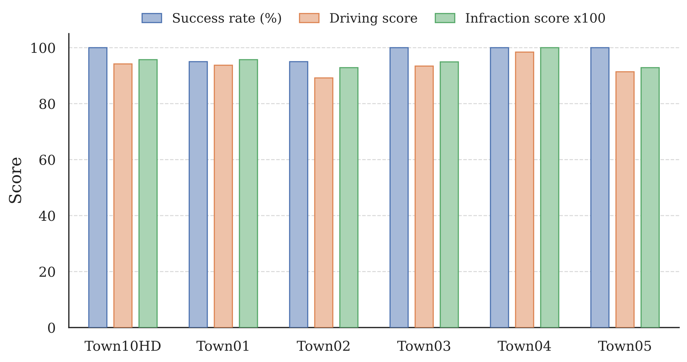
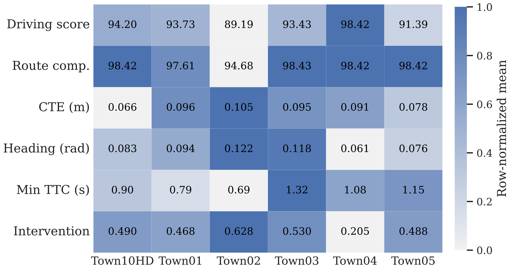
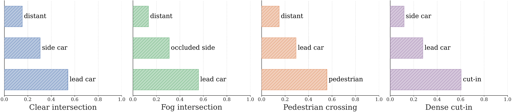
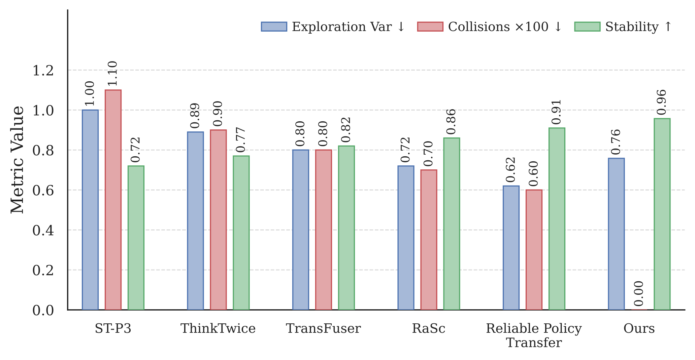
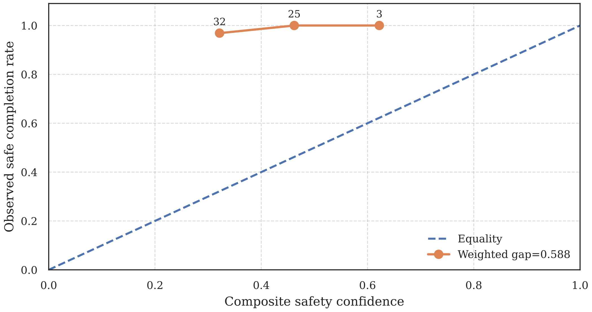
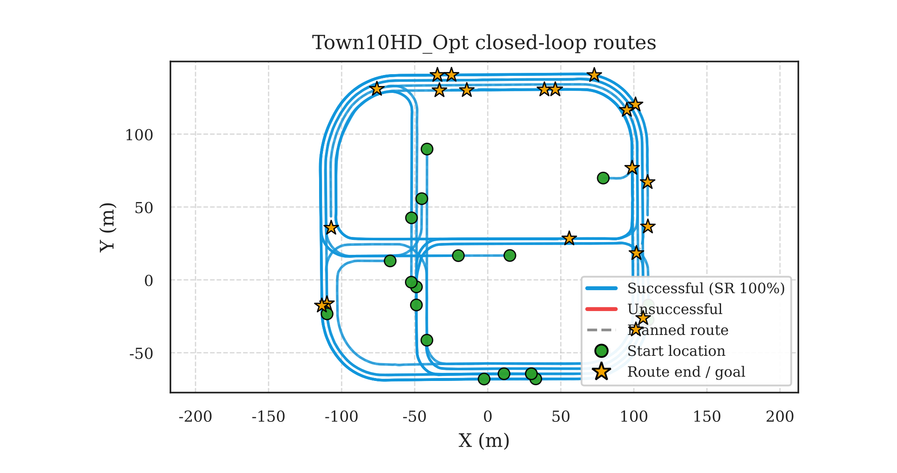
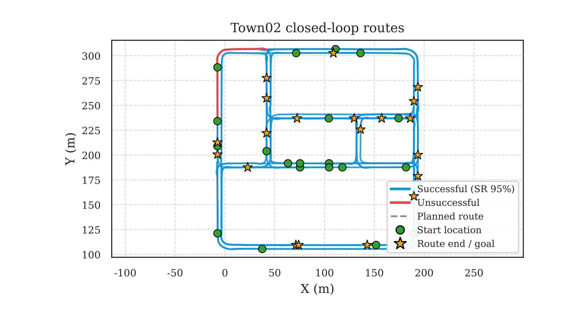

# Ego-Relational Policy Transfer for Safety-Aware End-to-End Autonomous Driving

**Uncertainty-calibrated ego-relational policy transfer for closed-loop autonomous driving in CARLA**

[](https://www.python.org/)
[](https://carla.org/)
[](https://pytorch.org/)
[](https://gymnasium.farama.org/)
[](#method-summary)
[](#evaluation-protocol)

> **Paper:** *Ego-Relational Policy Transfer for Safety-Aware End-to-End Autonomous Driving*  
> **Training implementation:** `code/car.py`  
> **Ablation implementation:** `code/car2.py`  
> **Evaluation implementation:** `code/car_eval.py`  
> **Task:** Closed-loop autonomous driving under town, weather, traffic, and route shift.

---

## Overview

<p align="justify">
This repository contains the CARLA implementation and experimental artifacts for <b>Ego-Relational Policy Transfer for Safety-Aware End-to-End Autonomous Driving</b>. The work studies how an end-to-end deep reinforcement learning policy can preserve closed-loop safety when the deployment town, weather, traffic density, and route configuration differ from the source training domain. Its central design is a shared reliability signal that connects ego-relational state construction, dense reward shaping, uncertainty-gated exploration, and cross-domain policy transfer.
</p>

<p align="justify">
The paper-aligned workflow separates learning from assessment. <code>code/car.py</code> contains source training, target adaptation, and target-only policy learning, but no evaluation loop. <code>code/car_eval.py</code> loads a frozen checkpoint, selects deterministic actions, performs no gradient updates, evaluates one town per process, and writes crash-resilient episode, step, route, trajectory, and summary records. <code>code/car2.py</code> adds matched component-ablation switches while preserving the same training environment and model interfaces.
</p>

<p align="justify">
Unlike methods that compress the complete scene into a single global tensor, the proposed policy represents nearby vehicles, pedestrians, traffic lights, lane geometry, route progress, and observation variance as an ego-centered relational state. A Soft Actor-Critic policy then predicts throttle, brake, and steering while uncertainty influences relational attention, reward shaping, exploration, and transfer alignment.
</p>

---

## Method Summary

<p align="center">
  
</p>

<p align="justify">
The framework connects four modules. First, the ego-relational encoder builds a compact graph over at most ten nearby entities within 60 m and applies variance-weighted influence attention. Second, the differentiable dense reward combines safety, route progress, comfort, and uncertainty so that the policy receives useful feedback before terminal failures. Third, aleatoric edge variance and epistemic critic-ensemble variance are fused into a normalized uncertainty signal that gates policy entropy. Fourth, adaptation aligns action distributions, relational attention, and uncertainty moments, with first-order MAML-style initialization supporting target-domain adaptation.
</p>

```text
CARLA scene observation
        |
        v
Ego-relational entity extraction
        |
        v
Uncertainty-weighted influence attention
        |
        v
Compact state encoder
        |
        v
SAC actor-critic policy
        |
        +--> Dense reward: safety + progress + comfort + uncertainty
        +--> Critic ensemble: epistemic uncertainty during learning
        +--> Entropy gate: beta(sigma_bar) = beta0 * (1 - sigma_bar)
        +--> Transfer: policy KL + attention MMD + uncertainty matching
        |
        v
Closed-loop throttle, brake, steering
```

### Paper configuration

| Component | Paper-aligned configuration | Stage |
|---|---|---|
| Entity set | At most 10 entities within 60 m | Training and inference |
| Edge features | Relative position, velocity, type, lane, and variance | Training and inference |
| Actor | Continuous throttle, brake, and steering | Training and inference |
| Critic ensemble | 5 critics | Training |
| Replay buffer | 200,000 transitions | Training |
| Batch size | 512 | Training |
| Discount / target update | `gamma = 0.99`, `tau = 5e-3` | Training |
| Optimizer | Adam, learning rate `3e-4` | Training |
| Entropy gate | `beta0` selected from `{0.5, 1.0}` | Training |
| Transfer | Policy KL, attention MMD, uncertainty moments, MAML-style initialization | Adaptation |
| Evaluation | 20 episodes, 500 m target routes, 20 NPC vehicles | Evaluation |

---

## Main Contributions Reflected in the Code

| Paper component | Implementation | Purpose |
|---|---|---|
| Ego-relational state | `CarlaReliableTransferEnv`, `_collect_entity_features()`, `GraphAttention`, `CompactStateEncoder` | Encodes nearby entities, lane context, route geometry, and uncertainty as a compact ego-centered state. |
| Dense multi-objective reward | `_compute_reward_components()`, `build_reward_from_info()`, `recompute_agent_reward()` | Converts safety, progress, comfort, rule compliance, and uncertainty into differentiable training feedback. |
| Aleatoric and epistemic uncertainty | Edge variance, 5-critic ensemble, `compute_sigma_bar()` | Combines observation variance and critic disagreement into the shared reliability signal. |
| Uncertainty-gated exploration | `UncertaintyCalibrator`, `entropy_coefficient()`, `compute_actor_loss()` | Reduces stochastic exploration as normalized uncertainty increases. |
| Influence-consistent transfer | `compute_transfer_loss()`, `maml_style_initialize()` | Aligns policy behavior, entity influence, and uncertainty statistics across domains. |
| Frozen closed-loop assessment | `code/car_eval.py` | Evaluates deterministic checkpoints without training or test-time calibration. |
| Component attribution | `code/car2.py`, `--ablation` | Trains isolated variants with one specified component removed. |

---

## Repository Layout

```text
drl-policy-transfer/
├── README.md
├── requirements.txt
├── car.py                                  <- legacy monolithic implementation
│
├── code/
│   ├── car.py                              <- paper-aligned training/adaptation only
│   ├── car2.py                             <- training/adaptation with ablation switches
│   └── car_eval.py                         <- frozen evaluation only; one town per process
│
├── diagrams/
│   ├── unified_framework.pdf
│   └── unified_framework.png
│
├── figs/                                   <- manuscript figures in vector PDF form
│   ├── framework.pdf
│   ├── reward.pdf
│   ├── uncertainty.pdf
│   └── unified_framework.pdf
│
├── graphs/                                 <- GitHub-renderable experimental figures
│   ├── standardized_closed_loop.png
│   ├── episode_statistics_heatmap.png
│   ├── influence_attention.png
│   ├── uncertainty_modulation.png
│   ├── safety_reliability_diagram.png
│   ├── reward_comparison.png
│   ├── state_route.png
│   ├── state_stability.png
│   ├── Town01_closed_loop_routes.png
│   ├── Town02_closed_loop_routes.png
│   ├── Town03_closed_loop_routes.png
│   ├── Town04_closed_loop_routes.png
│   ├── Town05_closed_loop_routes.png
│   └── Town10HD_Opt_closed_loop_routes.png
│
├── results/
│   ├── evaluation/
│   │   ├── Town01/
│   │   ├── Town02/
│   │   ├── Town03/
│   │   ├── Town04/
│   │   ├── Town05/
│   │   └── Town10HD_Opt/
│   ├── routes/                             <- 20 route CSVs per evaluated town
│   └── ablations/                          <- ablation checkpoints and evaluation records
│
├── screenshot/
└── video/
```

Each complete evaluation directory contains `episodes.csv`, `summary.csv`, `summary.json`, `routes.csv`, `trajectories.csv`, and per-episode records under `routes/` and `steps/`.

---

## Code Tour

### `code/car.py`

<p align="justify">
This is the primary learning implementation. It intentionally excludes evaluation so that training rollouts cannot be confused with frozen test episodes.
</p>

| Section / object | Role |
|---|---|
| `_setup_carla_pythonapi()` | Discovers a compatible CARLA Python API installation. |
| `Config` | Stores simulator, route, reward, uncertainty, optimization, and output settings. |
| `CarlaReliableTransferEnv` | Handles synchronous CARLA stepping, traffic, routing, observations, reward, and terminal conditions. |
| `GraphAttention` / `CompactStateEncoder` | Builds the uncertainty-weighted relational control state. |
| `Actor` / `Critic` | Implements continuous control and the critic ensemble. |
| `UncertaintyCalibrator` | Maps raw decision variance into normalized uncertainty. |
| `SACAgent` | Implements action selection, SAC updates, uncertainty gating, transfer loss, and checkpoints. |
| `train_loop()` | Executes source, adaptation, or target-only learning. |
| `run_source_training()` | Trains the source policy in Town10HD_Opt. |
| `run_target_adaptation()` | Adapts the source checkpoint using target and source-domain replay. |
| `run_target_policy_learning()` | Trains a target policy without transfer for comparison. |

### `code/car_eval.py`

| Property | Behavior |
|---|---|
| Policy state | Frozen, deterministic, no gradients |
| Scope | One town and one weather condition per process |
| Score | Bounded local `DS_local = RC * IS_local` |
| Logging | Episode, route, step, trajectory, attention, uncertainty, and summary data |
| Recovery | Atomic CSV/JSON writes, resume support, server retry support |
| Test calibration | Disabled; an unfitted checkpoint calibrator remains unfitted |

### `code/car2.py`

The ablation runner supports:

```text
full
no_uncertainty_attention
no_critic_ensemble
no_entropy_gate
event_reward
no_transfer_alignment
no_maml
```

The first four removed-module variants alter source training. Transfer-alignment and MAML removals alter target adaptation and must be evaluated from their resulting frozen target checkpoints.

---

## Requirements

### Recommended system

- Ubuntu 20.04 or 22.04
- Python 3.10
- NVIDIA GPU recommended
- CARLA 0.9.15 server and matching Python API
- PyTorch 2.x
- Gymnasium

The current paper-aligned files under `code/` import `gymnasium` directly. Legacy OpenAI Gym is not sufficient for those files.

### Python environment

```bash
conda create -n drl-transfer python=3.10 -y
conda activate drl-transfer
python -m pip install numpy torch gymnasium
```

Install the CARLA 0.9.15 Python API separately and ensure that the client and server versions match. The code searches common CARLA installations and also honors `CARLA_ROOT`.

```bash
export CARLA_ROOT=/path/to/CARLA_0.9.15
export PYTHONPATH="$CARLA_ROOT/PythonAPI/carla:$PYTHONPATH"
```

Useful references:

- [CARLA 0.9.15 Python API](https://carla.readthedocs.io/en/0.9.15/python_api/)
- [CARLA world and client](https://carla.readthedocs.io/en/0.9.15/core_world/)
- [Gymnasium migration guide](https://gymnasium.farama.org/introduction/migration_guide/)

---

## Quick Start

### 1. Clone the repository

```bash
git clone https://github.com/szu-ai/drl-policy-transfer.git
cd drl-policy-transfer
```

### 2. Start CARLA

In the CARLA installation directory:

```bash
./CarlaUE4.sh -quality-level=Low -nosound -carla-rpc-port=2200
```

Keep the server running. Rendering can be disabled by the Python client with `--no-rendering`; this follows CARLA's documented no-rendering workflow and avoids requiring a display-specific server flag.

### 3. Verify the connection

```bash
python - <<'PY'
import carla

client = carla.Client("localhost", 2200)
client.set_timeout(30.0)
print("Server:", client.get_server_version())
print("Map:", client.get_world().get_map().name)
PY
```

### 4. Inspect the command interfaces

```bash
python code/car.py --help
python code/car_eval.py --help
python code/car2.py --help
```

---

## How to Run

### A. Paper-scale source training

The manuscript trains for 500,000 environment steps in adverse Town10HD conditions with 20 NPC vehicles. Paper-faithful training leaves the optional curriculum, safety shield, and red-light assist disabled.

```bash
PYTHONUNBUFFERED=1 python -u code/car.py \
  --mode train \
  --train-town Town10HD_Opt \
  --source-weather night_rain_fog \
  --train-steps 500000 \
  --train-npc-min 20 \
  --train-npc-max 20 \
  --train-walker-min 0 \
  --train-walker-max 0 \
  --spawn-index -1 \
  --train-goal-index -1 \
  --route-target-length 500 \
  --host localhost \
  --port 2200 \
  --tm-port 8000 \
  --seed 42 \
  --no-rendering \
  --no-follow-ego-view \
  --out-dir ./runs/source/full/seed_42 \
  --debug
```

Expected checkpoint:

```text
runs/source/full/seed_42/models/source_agent.pt
```

### B. Frozen source-stress evaluation on Town10HD

```bash
python -u code/car_eval.py \
  --car-module ./code/car.py \
  --checkpoint ./runs/source/full/seed_42/models/source_agent.pt \
  --town Town10HD_Opt \
  --protocol source_stress \
  --weather night_rain_fog \
  --episodes 20 \
  --npc-min 20 \
  --npc-max 20 \
  --walker-min 0 \
  --walker-max 0 \
  --use-safety-shield \
  --no-red-light-assist \
  --attention-score-form reliability \
  --spawn-index -1 \
  --goal-index -1 \
  --route-target-length 500 \
  --host localhost \
  --port 2200 \
  --tm-port 8010 \
  --seed 42 \
  --no-rendering \
  --no-follow-ego-view \
  --overwrite \
  --out-dir ./runs/evaluation/Town10HD_Opt
```

### C. Zero-shot evaluation on Town05

The zero-shot condition uses the frozen source checkpoint without adaptation.

```bash
python -u code/car_eval.py \
  --car-module ./code/car.py \
  --checkpoint ./runs/source/full/seed_42/models/source_agent.pt \
  --town Town05 \
  --protocol zero_shot \
  --weather mixed \
  --episodes 20 \
  --npc-min 20 \
  --npc-max 20 \
  --walker-min 0 \
  --walker-max 0 \
  --use-safety-shield \
  --no-red-light-assist \
  --attention-score-form reliability \
  --spawn-index -1 \
  --goal-index -1 \
  --route-target-length 500 \
  --host localhost \
  --port 2200 \
  --tm-port 8010 \
  --seed 42 \
  --no-rendering \
  --no-follow-ego-view \
  --overwrite \
  --out-dir ./runs/evaluation/Town05
```

### D. MAML-style target adaptation for Town01-Town04

The paper protocol labels Town01-Town04 as adapted target domains. Adaptation with transfer alignment requires two CARLA servers: the target server on port `2200` and a source-replay server on a distinct RPC port such as `2300`.

Example for Town01:

```bash
TARGET=Town01
ADAPT_RUN="./runs/adaptation/${TARGET}/seed_42"

PYTHONUNBUFFERED=1 python -u code/car.py \
  --mode adapt \
  --source-checkpoint ./runs/source/full/seed_42/models/source_agent.pt \
  --train-town Town10HD_Opt \
  --target-town "$TARGET" \
  --source-weather night_rain_fog \
  --target-weather night_rain_fog \
  --adapt-steps 50000 \
  --adapt-episodes 100 \
  --adapt-maml-warmup-batches 8 \
  --maml-inner-steps 1 \
  --npc-min 20 \
  --npc-max 20 \
  --walker-min 0 \
  --walker-max 0 \
  --train-npc-min 20 \
  --train-npc-max 20 \
  --train-walker-min 0 \
  --train-walker-max 0 \
  --spawn-index -1 \
  --train-goal-index -1 \
  --target-goal-index -1 \
  --route-target-length 500 \
  --host localhost \
  --port 2200 \
  --source-port 2300 \
  --tm-port 8010 \
  --source-tm-port 8001 \
  --seed 42 \
  --no-rendering \
  --no-follow-ego-view \
  --out-dir "$ADAPT_RUN" \
  --debug
```

Evaluate the resulting adapted checkpoint in a separate process:

```bash
python -u code/car_eval.py \
  --car-module ./code/car.py \
  --checkpoint "$ADAPT_RUN/models/target_agent.pt" \
  --town "$TARGET" \
  --protocol extended \
  --weather night_rain_fog \
  --episodes 20 \
  --npc-min 20 \
  --npc-max 20 \
  --walker-min 0 \
  --walker-max 0 \
  --use-safety-shield \
  --no-red-light-assist \
  --attention-score-form reliability \
  --spawn-index -1 \
  --goal-index -1 \
  --route-target-length 500 \
  --host localhost \
  --port 2200 \
  --tm-port 8010 \
  --seed 42 \
  --no-rendering \
  --no-follow-ego-view \
  --overwrite \
  --out-dir "./runs/evaluation/${TARGET}"
```

Repeat with `TARGET=Town02`, `Town03`, and `Town04`. Running one town per process reduces CARLA map-switch and cleanup failures.

### E. Matched ablation training

Train one source-stage ablation at a time:

```bash
ABLATION=no_uncertainty_attention

PYTHONUNBUFFERED=1 python -u code/car2.py \
  --mode train \
  --ablation "$ABLATION" \
  --ablation-out-root ./runs/ablations \
  --train-town Town10HD_Opt \
  --source-weather night_rain_fog \
  --train-steps 500000 \
  --train-npc-min 20 \
  --train-npc-max 20 \
  --train-walker-min 0 \
  --train-walker-max 0 \
  --spawn-index -1 \
  --train-goal-index -1 \
  --route-target-length 500 \
  --host localhost \
  --port 2200 \
  --tm-port 8000 \
  --seed 42 \
  --no-rendering \
  --no-follow-ego-view \
  --progress-every-steps 1000 \
  --debug
```

Valid source-stage choices are `no_uncertainty_attention`, `no_critic_ensemble`, `no_entropy_gate`, and `event_reward`. The `no_transfer_alignment` and `no_maml` variants must be run with `--mode adapt`, because those components affect adaptation rather than source training.

---

## Important Runtime Options

| Option | Meaning |
|---|---|
| `--mode train` | Train the source policy. |
| `--mode adapt` | Adapt a source checkpoint to a target domain. |
| `--mode policy` | Train a target-only policy without transfer. |
| `--car-module` | Training module imported by the evaluation-only script. |
| `--town` | Single evaluation town. |
| `--protocol` | `source_stress`, `zero_shot`, `cross_town`, `extended`, or `auto`. |
| `--episodes` | Number of frozen closed-loop evaluation episodes; paper default is 20. |
| `--train-steps` | Source environment-step budget; paper setting is 500,000. |
| `--adapt-steps` | Target adaptation step budget. |
| `--route-target-length` | Desired route length; paper setting is 500 m with a 490-510 m acceptance window. |
| `--train-npc-min/max` | Source-training vehicle count range. |
| `--npc-min/max` | Target/adaptation/evaluation vehicle count range. |
| `--walker-min/max` | Evaluation pedestrian count range. |
| `--attention-score-form reliability` | Uses distance and variance penalties matching the manuscript text and Table I. |
| `--use-safety-shield` | Enables bounded evaluation assistance; every intervention is logged. |
| `--enable-training-curriculum` | Optional non-paper bootstrap; disabled by default and must be disclosed if used. |
| `--no-rendering` | Disables CARLA rendering through world settings. |
| `--resume` / `--overwrite` | Resume an interrupted evaluation or replace an existing output directory. |

---

## Evaluation Protocol

<p align="justify">
Experiments use CARLA 0.9.15 with synchronous stepping at 20 Hz and 500 m target routes. The manuscript reports 20 closed-loop episodes for Town10HD_Opt and Town01-Town05 with 20 NPC vehicles and no walkers. Town10HD_Opt is the adverse source-stress domain, Town05 is the mixed-weather zero-shot target, and Town01-Town04 are labeled as MAML-style adapted targets. Each town is evaluated in a separate process with a frozen deterministic policy.
</p>

For episode `i`, the repository evaluator reports:

```text
DS_local_i = RC_i * IS_local_i
```

where `RC_i` is route completion in percent and `IS_local_i` is the reciprocal penalty over collision, red-light, and timeout events observable in this environment. The reported mean is the average of episode-level driving scores; it is not generally equal to mean RC multiplied by mean IS.

`DS_local` is bounded in `[0, 100]`, but it is not an official CARLA Leaderboard score because the local environment does not expose every Leaderboard event. The evaluator preserves this distinction in `summary.json`.

| Metric | Meaning | Direction |
|---|---|---:|
| `success_rate_pct` | Episodes reaching the goal without terminal failure | Higher |
| `mean_route_completion_pct` | Mean route completion | Higher |
| `mean_local_driving_score` | Mean bounded local DS | Higher |
| `mean_local_infraction_score` | Mean local infraction score | Higher |
| `mean_cte_m` | Mean cross-track error | Lower |
| `mean_abs_route_heading_rad` | Mean absolute route-heading error | Lower |
| `mean_min_ttc_s` | Mean episode minimum time-to-conflict | Higher |
| `mean_intervention_rate` | Fraction of steps using bounded assistance | Lower, conditional on safety |
| `collisions_per_km` | Collision count normalized by traveled distance | Lower |
| `timeouts_per_km` | Timeout count normalized by traveled distance | Lower |

### Protocol and provenance note

The committed `results/evaluation/*/summary.json` files reproduce the numerical values used in the manuscript tables. However, the metadata for Town01-Town04 records `source_agent.pt` rather than a per-town `target_agent.pt`. Therefore, the committed metadata alone does not establish that those four archived directories came from adapted checkpoints. For a strictly auditable manuscript reproduction, rerun Town01-Town04 from their adapted target checkpoints and retain each checkpoint path and hash in the result metadata.

---

## Included Evaluation Results

The following values match the manuscript's six-domain closed-loop tables and the committed summary files.

| Setting | Town | Episodes | SR (%) | DS | RC (%) | IS | CTE (m) | Heading (rad) | Min TTC (s) | Intervention | Coll./km |
|---|---|---:|---:|---:|---:|---:|---:|---:|---:|---:|---:|
| Source stress | Town10HD_Opt | 20 | 100.0 | 94.20 | 98.42 | 0.957 | 0.066 | 0.083 | 0.902 | 0.490 | 0.0000 |
| Paper: MAML adaptation | Town01 | 20 | 95.0 | 93.73 | 97.61 | 0.957 | 0.096 | 0.094 | 0.786 | 0.468 | 0.1024 |
| Paper: MAML adaptation | Town02 | 20 | 95.0 | 89.19 | 94.68 | 0.929 | 0.105 | 0.122 | 0.685 | 0.628 | 0.1055 |
| Paper: MAML adaptation | Town03 | 20 | 100.0 | 93.43 | 98.43 | 0.949 | 0.095 | 0.118 | 1.323 | 0.530 | 0.0000 |
| Paper: MAML adaptation | Town04 | 20 | 100.0 | 98.42 | 98.42 | 1.000 | 0.091 | 0.061 | 1.075 | 0.205 | 0.0000 |
| Zero-shot | Town05 | 20 | 100.0 | 91.39 | 98.42 | 0.929 | 0.078 | 0.076 | 1.145 | 0.488 | 0.0000 |

Town04 provides the strongest aggregate score, while Town10HD_Opt has the lowest mean CTE. Town02 is the most interaction-sensitive condition: it has the lowest mean DS and TTC and the highest intervention rate, despite low lateral error. This is why the paper reports completion, infractions, geometric stability, TTC, and intervention burden together rather than relying on one aggregate score.

### Module ablation on Town02

| Variant | SR (%) | RC (%) | DS | IS | Coll./km | Timeout/km |
|---|---:|---:|---:|---:|---:|---:|
| Without uncertainty attention | 0.0 | 4.98 | 3.11 | 0.625 | 38.5632 | 0.0000 |
| Without critic ensemble | 30.0 | 49.75 | 38.26 | 0.695 | 2.7938 | 0.0000 |
| Without entropy gate | 60.0 | 89.76 | 76.69 | 0.836 | 0.3323 | 0.5538 |
| Event-driven reward | 50.0 | 87.34 | 71.86 | 0.805 | 0.0000 | 1.1437 |
| Without transfer alignment | 0.0 | 0.24 | 0.15 | 0.705 | 80.8573 | 727.7161 |
| Without MAML initialization | 0.0 | 0.00 | 0.00 | 0.714 | 0.0000 | N/A |
| Full model | 95.0 | 94.68 | 89.19 | 0.929 | 0.1055 | 0.0000 |

For the no-MAML variant, timeout/km is not meaningful: all 20 episodes were timeout-penalized while total traveled distance was approximately `3.81e-9 km`. Dividing by this near-zero exposure produces an unstable raw rate.

---

## Output Files Generated by Evaluation

```text
<out-dir>/
├── episodes.csv               <- one row per completed episode
├── summary.csv                <- aggregate metrics
├── summary.json               <- metrics, arguments, checkpoint, protocol, and score definition
├── routes.csv                 <- combined planned routes
├── trajectories.csv           <- combined ego trajectory records
├── routes/
│   └── episode_XXX.csv
└── steps/
    └── episode_XXX.csv
```

Useful checks:

```bash
head ./runs/evaluation/Town05/summary.csv
python -m json.tool ./runs/evaluation/Town05/summary.json | less
wc -l ./runs/evaluation/Town05/episodes.csv
```

---

## Visual Outputs and Graph Explanations

### Cross-domain closed-loop results

<p align="center">
  
</p>

This figure compares success rate, bounded driving score, and infraction score across the six evaluation towns.

### Episode-level statistics

<p align="center">
  
</p>

The heatmap exposes domain-specific differences in completion, safety, geometric stability, and intervention behavior that are hidden by a single mean score.

### Influence attention

<p align="center">
  
</p>

The influence examples show how the relational state prioritizes a lead vehicle, pedestrian, side vehicle, or cut-in vehicle depending on the local scene.

### Uncertainty modulation and reliability

<p align="center">
  
  
</p>

These figures are diagnostics of uncertainty activity and empirical safety behavior. They are not deployment safety certificates, and an unfitted checkpoint calibrator must not be described as held-out calibrated.

### State and route behavior

<p align="center">
  
  
</p>

### Logged closed-loop trajectories

<p align="center">
  
  
</p>

All 20 logged episodes are retained in the corresponding result directories. Planned routes, successful and unsuccessful ego rollouts, start positions, and goals should be interpreted together with terminal reasons and quantitative metrics.

---

## Screenshots and Videos

```text
screenshot/1.png
screenshot/2.png
screenshot/3.png
video/1.mp4
video/2.mp4
video/3.mp4
```

<p align="center">
  
  
  
</p>

---

## Paper-Code Alignment Notes

| Item | Repository behavior | Reporting requirement |
|---|---|---|
| Attention score | Default `reliability` form penalizes distance and variance, matching the manuscript text and Table I. `paper_ratio` reproduces the printed Eq. (6), whose variance behavior is inconsistent with that text. | Report which form was used. |
| MAML | The implementation is a first-order approximation and omits exact second-order meta-gradients. | Describe it as first-order MAML-style initialization. |
| Training curriculum | Optional scripted route guidance and traffic ramp; disabled by default. | It is not part of the paper method. Disclose it and apply it to all matched baselines if enabled. |
| Safety assistance | The shield and red-light assist are deployment/evaluation interventions. | Report intervention rate and assistance flags with DS and SR. |
| Driving score | Evaluator computes a bounded local score from observable events. | Do not call it an official CARLA Leaderboard score. |
| Uncertainty calibration | Evaluation never fits the calibrator on test data. | If the checkpoint calibrator is unfitted, report uncertainty as diagnostic rather than held-out calibrated. |
| Checkpoint selection | Training can save final and optional training-selected checkpoints. | Use final checkpoints or a separate validation set; do not select on the test towns. |

---

## Reproducibility Notes

- Use CARLA 0.9.15 on both the server and Python client.
- Use synchronous stepping at 20 Hz.
- Use 500 m target routes and record the actual planned length.
- Evaluate exactly 20 episodes per town for the paper tables.
- Use 20 NPC vehicles and 0 walkers for the supplied protocol.
- Use seed 42 for the supplied single-seed runs; do not present this as multi-seed uncertainty.
- Run one town per evaluation process and keep town-specific output directories.
- Freeze the actor, disable gradients, and preserve deterministic action selection during evaluation.
- Keep source-stress, adapted-target, and zero-shot checkpoint roles explicit.
- Record checkpoint paths and preferably SHA-256 hashes in experiment metadata.
- Report local DS, RC, IS, TTC, CTE, heading error, collision/km, timeout/km, and intervention rate together.
- Preserve unsuccessful episodes and terminal reasons; do not plot only successful trajectories.

---

## Troubleshooting

### `ModuleNotFoundError: carla`

```bash
export CARLA_ROOT=/path/to/CARLA_0.9.15
export PYTHONPATH="$CARLA_ROOT/PythonAPI/carla:$PYTHONPATH"
python -c "import carla; print(carla.__file__)"
```

### Gym reports that it is unmaintained

The paper-aligned code requires Gymnasium:

```bash
python -m pip uninstall -y gym
python -m pip install gymnasium
```

### CARLA times out or crashes while changing towns

Evaluate only one town per process. If the server becomes unstable, restart CARLA, verify the loaded map, and then launch the next town's evaluation. CARLA's `client.load_world()` destroys the existing world and creates a new one, so stale Traffic Manager or actor state can make repeated in-process transitions fragile.

### `Checkpoint not found`

The repository snapshot contains evaluation records and several ablation checkpoints, but it does not contain the full source checkpoint referenced by the committed result metadata. Train the full source policy or place the intended checkpoint at the path supplied to `--checkpoint`.

### Existing results prevent evaluation

Use one of the mutually exclusive options:

```bash
--resume
```

or:

```bash
--overwrite
```

### The calibrator is not fitted

This warning is expected for the supplied checkpoint metadata. Evaluation correctly refuses to fit calibration parameters on test episodes. Report `sigma_bar` as a diagnostic signal until a training-held-out calibration split is available.

### The vehicle remains stopped or times out

Inspect the step CSVs for throttle, brake, traffic-light state, progress, TTC, safety intervention, and terminal reason. A stopped vehicle can result from conservative actor output, red-light logic, blocked traffic, an invalid adapted checkpoint, or a route/recovery failure.

---

## Limitations

<p align="justify">
The repository supports reproducible simulation analysis, not real-world deployment certification. The supplied results are single-seed CARLA evaluations, the local driving score covers only events exposed by this environment, and the archived uncertainty calibrator is not fitted on a held-out training split. The result metadata also does not independently establish adapted-checkpoint provenance for Town01-Town04. Real-vehicle deployment would additionally require validated perception, sensor calibration, fail-safe control, operational design-domain constraints, safety-driver supervision, and compliance with applicable regulations.
</p>

